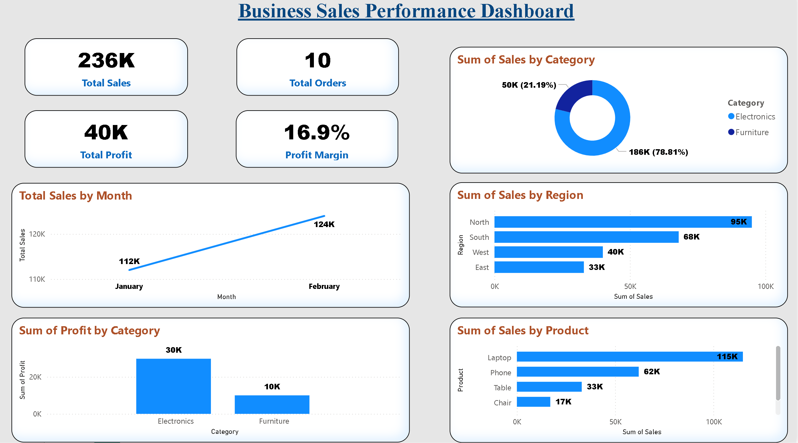

# FUTURE_DS_01 – Sales Dashboard

# Task 1: Business Sales Analysis Dashboard

This project presents a Business Sales Performance Dashboard developed as part of my internship Task 1. The dashboard delivers key insights into sales performance, profitability, and product-level analysis through interactive visualizations.

## 🔹 Key Features:
- KPI cards displaying Total Sales, Total Profit, Total Orders, and Profit Margin  
- Monthly sales trend analysis for performance tracking  
- Category-wise and Region-wise sales distribution  
- Product-level analysis to identify top-performing items  
- Clean and structured dashboard design for better readability  

## 🛠 Tools & Technologies:
- Power BI  
- Microsoft Excel  

## 📌 Dataset:
The dataset contains sales-related information such as product details, category, region, sales, profit, quantity, and order data.

## 📊 Insights Gained:
- Electronics category contributes the highest profit  
- North region generates the highest sales  
- Laptop is the top-performing product  
- Sales show a consistent upward trend over time  

## 📷 Dashboard Preview:

## 📁 Files Included:
- Sales_Dashboard.pbix  
- sales_data.xlsx  
- Dashboard.png  

## 🎯 Conclusion:
This dashboard provides a comprehensive overview of business sales performance, enabling data-driven decision-making. It highlights key trends and insights, demonstrating effective use of Power BI for data visualization and business analysis.
